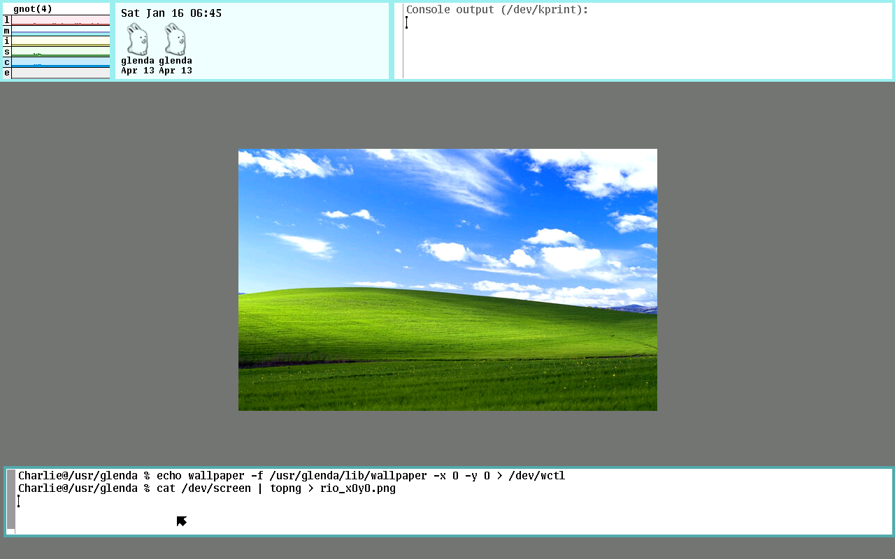
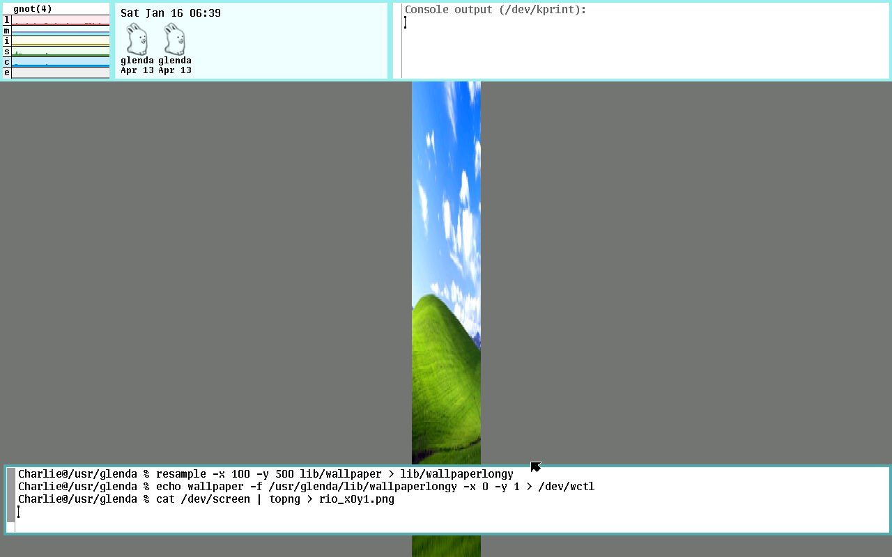
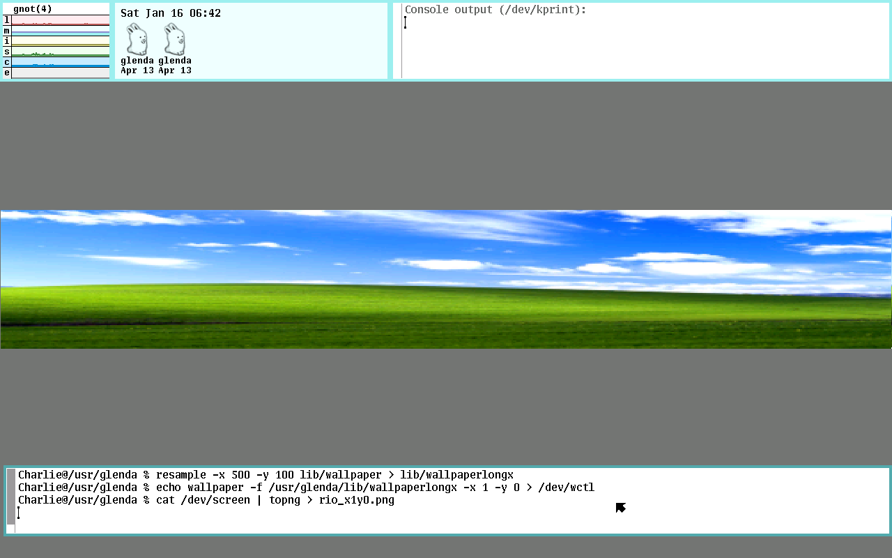
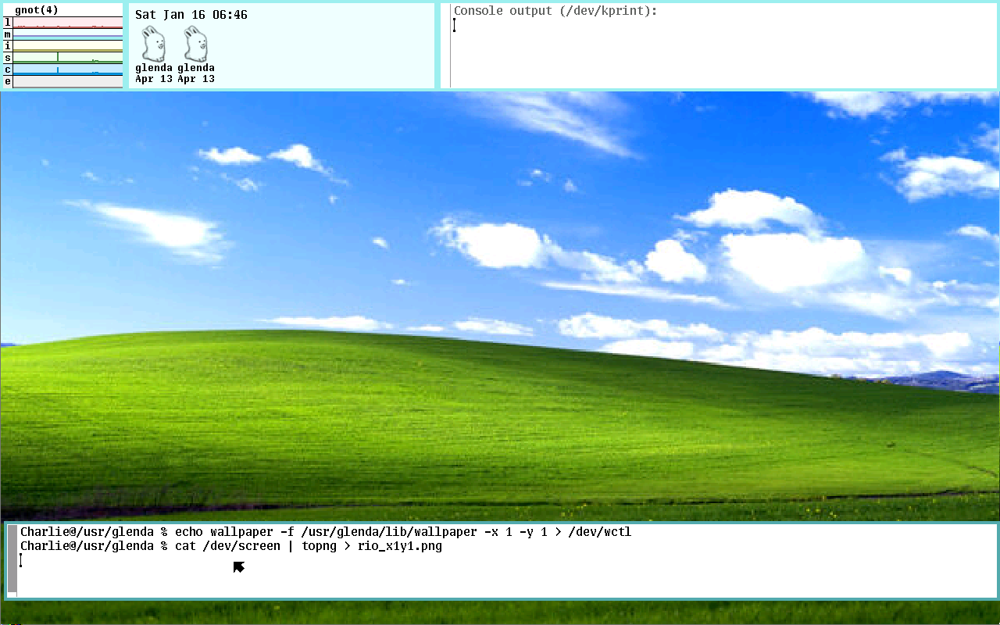
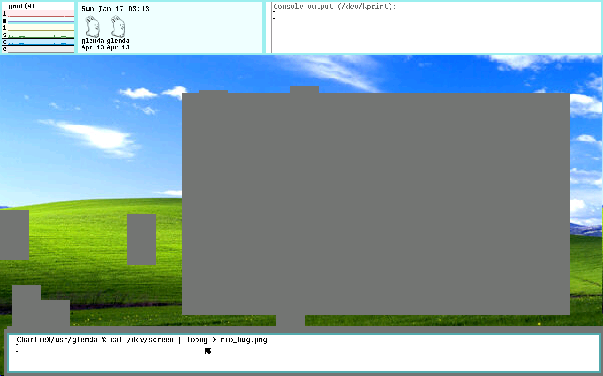
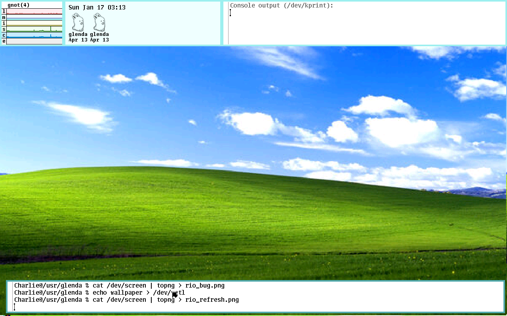

# Interactive Wallpaper for Rio

The Rio window manager for Plan 9, now with wallpapers

In the Fall of 2021 I was in lab with another TA making jokes about
[running Doom](https://knowyourmeme.com/memes/it-runs-doom). I said I wanted to
do a similar concept where I put the Windows XP hills background in places it
does not belong. Given my research with Plan 9, I decided to start there. I used
<https://wiki.xxiivv.com/site/rio.html>
as a starting point, but have heavily expanded on this.

Once I had completed my project, I learned
[Rob Pike once said](https://marc.info/?l=9fans&m=111558908224071):

> the clean appearance of the screen comes mostly from laziness, but the color
> scheme is (obviously) deliberate. the intent was to build on an observation by
> edward tufte that the human system likes nature and nature is full of pale
> colors, so something you're going to look at all day might best serve if it
> were also in relaxing shades.  renee french helped me with the specifics of
> the color scheme (she's a professional illustrator and my color vision is
> suspect), once i'd figured out how i wanted it to look. there are still some
> features of the color system that i put in that i think no one has ever
> noticed. that's a good thing, in my opinion; the colors should fade away, if
> you'll pardon the expression.
>
> having used other systems with different approaches to color screens, most
> especially windows XP (extra pukey), i think tufte was right.
>
> -rob

While this project is titled **Interactive Wallpaper for Rio**, an alternative
and perhaps more accurate title is **A Formal Apology to Rob Pike**

- [Installation](#installation)
- [Plan 9 Image Format](#plan-9-image-format)
- [wctl Commands](#wctl-commands)
- [Load Wallpaper on Start Up](#load-wallpaper-on-start-up)
- [Bugs](#bugs)

### Installation

I haven't had the time to look into how to make a patch and I've edited a few
different files here, so this repo is just all the Rio source code, and I'll
look into patches and such later.

With the exception of the `imgs/` directory. these files belong in
`/sys/src/cmd/rio` in the Plan 9 operating system. From there, it's as simple
as

```
$ mk install
$ mk clean
$ fshalt -r
```

Basically, run the `mkfile` that's in the `/sys/src/cmd/rio` source code
directory. then restart the system.

### Plan 9 Image Format

All images used as a background must be in the Plan 9 image format. This can be
done with:

```
FMT -9t wallpaper.FMT > wallpaper
```

Where `FMT` is replaced with the image format. Supported formats include `jpg`,
`gif`, `png`, `ppm`, `bmp`, and `yuv`. 


### wctl Commands

To interact with the wallpaper, change the file, and set up how it's scaled,
`echo` commands to the `/dev/wctl` file.

```
echo wallpaper [-f filename] [-x scale] [-y scale] > /dev/wctl
```

All arguments are optional. Running the command without arguments will "refresh"
the wallpaper.

The `filename` should be the absolute path to the file. I haven't yet tried with
with relative paths, now that I think about it. Setting `-x` and `-y` to 0 and 1
will scale the image to fit the screen in the x or y dimension. I included
images below to demonstrate this.







### Load Wallpaper on Start Up

This isn't as clean as I'd like it, but to have the wallpaper loaded
automatically on start up, there's a few parts.

First, create the file `usr/glenda/lib/autowp` where `glenda` is your username.
This file should have the following contents:

```
#!/bin/rc
echo wallpaper -f /usr/glenda/lib/wallpaper > /dev/wctl
```

Basically, this file should have the `wctl` command that we want to have on
start up. Automatically, the wallpaper is set to be scaled by both the x and y
components. This could lead to a warped image, but it's really up to the user
and what they want. For the wallpaper I'm using on the screen I'm using, you
don't get much warp. If you want to change how x and y are scaled or where the
wallpaper source file is pulled from, you can specify that here.

Then, in `/bin/riostart` include the following:

```
window -r 0 0 161 117 /usr/glenda/lib/autowp
```

When running `exec rio -i riostart` on start up, this will create a quick
window in the top left corner which executes the `wctl` command and then closes.
I hide this window underneath where my CPU usage will be.

### Bugs

When opening up the middle and right click menu or moving or resizing windows,
the wallpaper "erases" itself and doesn't refresh properly. This can be fixed
by either resizing the window that has the background, or refreshing the
wallpaper by calling:

```
echo wallpaper > /dev/wctl
```




